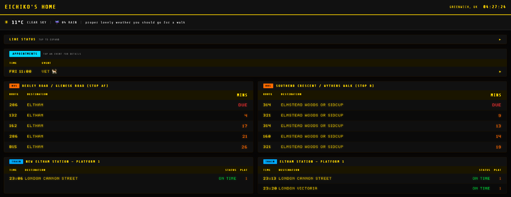
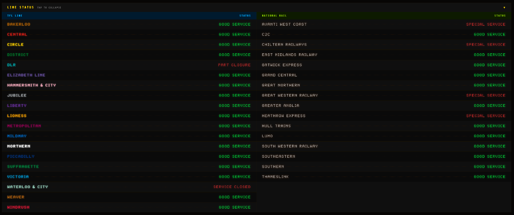
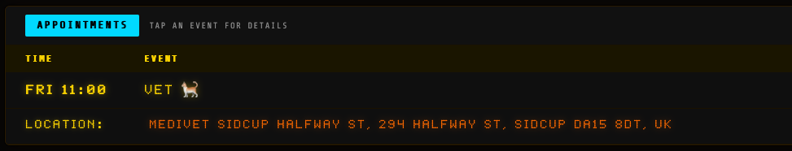
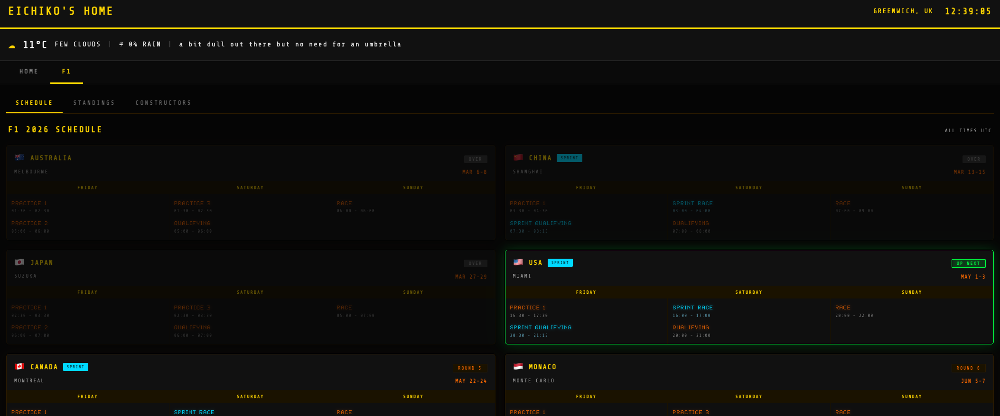

[](https://app.netlify.com/projects/eichiko-home/deploys)


---

# Eichiko's Home

That's my cat's name in case you were wondering. It's a personal real-time dashboard designed to be fully responsive across all devices, styled as an LED dot-matrix departure board. Displays live London transport data, local weather, and upcoming calendar events all in one place.

Built to minimize information overload with a focused, personal dashboard that streamlines daily routines.

>Live demo: https://eichiko-home.netlify.app

---

## Table of Contents
- [Screenshots](#screenshots)
- [Features](#features)
  - [Weather Bar](#weather-bar)
    - [Editable Title & Location](#editable-title--location)
  - [Line Status](#line-status)
  - [Bus Arrivals](#bus-arrivals)
  - [Train Departures](#train-departures)
    - [Configurable Transport Panel System](#configurable-transport-panel-system)
  - [Appointments](#appointments)
  - [F1 2026 Schedule](#f1-2026-schedule)
    - [F1 Standings (Driver & Constructor)](#f1-standings-driver--constructor)
- [Navigation](#navigation)
  - [Edit Mode](#edit-mode)
- [Tech Stack](#tech-stack)
- [Data Sources](#data-sources)
- [Environment Variables](#environment-variables)
- [Development](#development)
- [Security](#security)

---

## Screenshots
#### Home


#### Line Status


#### Appointments


#### F1 Schedule


## Features

### Weather Bar
Shows current conditions for a user-selected location: temperature, probability of rain, and a rotating casual phrase that regularly updates.

#### Editable Title & Location
Long-press (or tap ⋮) to enter edit mode:
- **Title**: Tap to edit the dashboard title (e.g., "EICHIKO'S HOME")
- **Location**: Tap to search and change the weather location using OpenWeatherMap Geocoding API
- Changes persist to localStorage and survive page refresh

### Line Status
Collapsible panel (collapsed by default) showing live service status for all TFL lines and National Rail routes relevant to London. TFL lines are shown on the left; London National Rail operators on the right.
Each line displays a coloured dot using official TFL brand colours.

### Bus Arrivals
User-configurable panels showing live arrivals for selected bus stops. Each row displays the bus route number, destination, and minutes until arrival. Buses arriving imminently show a blinking "DUE" indicator.

### Train Departures
User-selected train station panels showing live departures. Each panel displays the destination, scheduled departure time, platform, and operator for upcoming trains. Supports multiple stations displayed side by side.

#### Configurable Transport Panel System
All bus and train panels are fully user-managed at runtime, no config files needed:
- **Add panels** via an in-page modal, tap **+ ADD STOP** at the bottom of the transport section
- **Remove panels** with a single tap in edit mode
- **Drag to reorder** panels freely using flexible grip handles (powered by `svelte-dnd-action`), only active in edit mode so normal touch scrolling is unaffected
- **Edit mode** toggled via a ⋮ button; shows remove controls and drag handles without cluttering the default view
- Panel layout adapts to a 2-column grid on tablet and stacks to a single column on mobile

#### Adding a Bus Stop
1. Tap **+ ADD STOP** → select the **BUS** tab
2. Type at least 2 characters to search TFL stops by name (live search via TFL API)
3. Select a stop from the results, if the stop has multiple directions (e.g. both sides of the road), a direction picker appears showing each stop letter and its towards destination
4. Pick the correct direction to add the panel

#### Adding a Train Station
1. Tap **+ ADD STOP** → select the **TRAIN** tab
2. Type a station name or its 3-letter CRS code (e.g. `LBG` for London Bridge)
3. Select the station from the results
4. Choose a specific platform to filter departures, or select **ALL** to show all platforms
---

### Appointments
Upcoming events from Google Calendar, fetched via a private ICS feed (no OAuth required). Shows up to 10 events with the day/time, event title, and an expandable row revealing location and description. Events are independently expandable by tapping. Refreshes every 30 seconds.

---

### F1 2026 Schedule
A dedicated F1 tab showing the full 2026 Formula 1 race calendar fetched live from the Jolpica F1 API. Each race card displays the circuit, date range, and a per-day session grid (Friday/Saturday/Sunday) with session names and UTC start/end times. Sprint weekends are visually distinguished. Races are automatically marked as OVER, UP NEXT, or a future round based on the current date.

#### F1 Standings (Driver & Constructor)
Within the F1 tab, three sub-tabs provide live championship standings:
- **SCHEDULE** — Race calendar (as above)
- **STANDINGS** — Driver championship points, wins, and team
- **CONSTRUCTORS** — Constructor championship points and wins

---

## Navigation

The dashboard uses a tab bar in the shared layout to switch between the **Home** transport view and the **F1** schedule. The header, weather bar, and clock persist across all tabs.

#### Edit Mode
- Tap the **⋮** button (top right) to enter edit mode
- Edit mode allows editing the title and location
- Tap **DONE** to exit edit mode

---

## Tech Stack

| Layer | Technology |
|-------|------------|
| Framework | [SvelteKit](https://kit.svelte.dev) (Svelte 5, runes-based reactivity) |
| Language | TypeScript |
| Styling | [Tailwind CSS v4](https://tailwindcss.com) via `@tailwindcss/vite` |
| Fonts | LED Dot-Matrix (CDN), Share Tech Mono |
| Server routes | SvelteKit `+server.ts` (proxy routes keep API keys off the client) |
| Deployment | [Netlify](https://netlify.com) via `@sveltejs/adapter-netlify` |
| Calendar parsing | [`node-ical`](https://www.npmjs.com/package/node-ical) |

---

## Data Sources

| Source | What it provides |
|--------|-----------------|
| [TFL Unified API](https://api-portal.tfl.gov.uk) | Line status, bus arrivals (requires free API key for higher rate limits) |
| [OpenWeatherMap API](https://openweathermap.org/api) | Current weather + precipitation forecast |
| [OpenWeatherMap Geocoding API](https://openweathermap.org/api/geocoding) | Location search (forward geocoding) |
| [Huxley 2](https://huxley2.azurewebsites.net) | National Rail train departures (community-hosted JSON proxy, no API key needed) |
| Google Calendar ICS feed | Personal calendar events via the secret iCal URL (read-only, no OAuth) |
| [Jolpica F1 API](https://github.com/jolpica/jolpica-f1) | F1 2026 race calendar, driver & constructor standings (open source Ergast replacement, no key needed) |

---

## Environment Variables

Set in `.env` locally, or in the Netlify dashboard for production:

```
TFL_APP_KEY=               # from https://api-portal.tfl.gov.uk (optional, higher rate limits)
OPENWEATHER_API_KEY=       # from https://openweathermap.org/api (required)
GOOGLE_CALENDAR_ICS_URL=   # from Google Calendar → Settings → Integrate calendar → "Secret address in iCal format"
```

All variables are server-side only, never exposed to the browser.

---

## Development

```bash
# Install dependencies
npm install

# Start dev server (http://localhost:5173)
npm run dev

# Type-check
npm run check

# Production build
npm run build

# Preview production build
npm run preview
```
---

## Security
- All API keys are server-side only (via SvelteKit server routes)
- Rate limiting on weather geocoding endpoint (60 requests/minute)
- Input validation on search queries (max 100 characters)
- CORS headers block unauthorized requests